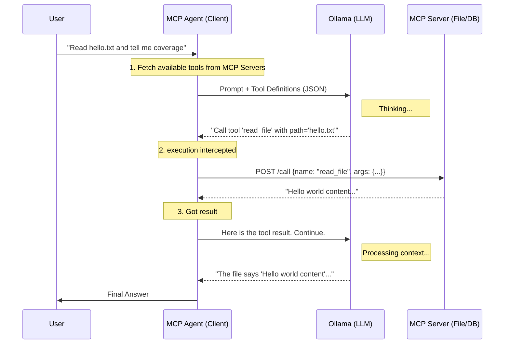

# MCP Lab 🧪

A fully containerized **Model Context Protocol (MCP)** playground.
This project demonstrates how to give "arms and legs" to an LLM (running on Ollama) by connecting it to local tools (Files, Database) using a modular, microservice-based architecture.

## 🏗️ Architecture

The system is composed of **three main parts**, orchestrated by Docker Compose:

1.  **The Brain (External)**: An **Ollama** instance (running locally or remotely) that provides the intelligence.
2.  **The Body (Agent)**: The `mcp-agent` container. It acts as the bridge between the Brain and the Tools.
3.  **The Tools (MCP Servers)**:
    *   `mcp-file`: A dedicated server that allows reading files from a secured directory.
    *   `mcp-db`: A dedicated server that performs SQL queries on a PostgreSQL database.

### The Flow 🔄

Understanding "the loop" is key to understanding MCP:



1.  **Discovery**: The Agent starts and asks the MCP Servers: *"What tools do you have?"*
2.  **Reasoning**: You send a prompt to the Agent. The Agent forwards your prompt **plus the list of tools** to Ollama.
3.  **Decision**: Ollama realizes it can't answer from training data alone. It responds with a structured **Tool Call Request** (e.g., *"Please run `read_file`"*).
4.  **Execution**: The Agent receives this request, finds the correct MCP Server (File or DB), and executes the command.
5.  **Synthesis**: The Agent takes the output from the tool and sends it back to Ollama. Ollama uses this new information to generate the final natural language response.

## 🚀 Getting Started

### Prerequisites

- **Docker** & **Docker Compose** installed.
- **Ollama** installed and running (accessible via network).
  - Ensure you have pulled the model: `ollama pull llama3.2:3b` (or your chosen model).

### Configuration

Edit `docker-compose.yml` to point to your Ollama instance:

```yaml
environment:
  - OLLAMA_URL=https://your-ollama-url:11434
  - MODEL_NAME=llama3.2:3b  # Must match a model you have pulled
```

### 🧠 Running the Lab (Two Options)

You can run the lab in two modes:

#### Option A: External Ollama (Default)
Use this if you have Ollama running on your host or another server.
1.  Configure `OLLAMA_URL` in `.env` (or leave default).
2.  Start:
    ```bash
    make up
    ```

#### Option B: Local Ollama (Self-Contained)
Use this if you want a dedicated Ollama container. It will pull `llama3.2:3b` automatically.
1.  Start:
    ```bash
    make up-local
    ```

### 🧪 Verifying & Testing

We use a `Makefile` to simplify commands.

1.  **Test Connectivity** (Integration Tests):
    ```bash
    make test        # Run all tests
    make test-file   # Test File Server only
    make test-db     # Test DB Server only
    ```
    *These tests verify that the MCP servers are up and responding to tool calls correctly.*

3.  **Talk to the Agent**:
    You can now ask the Agent to perform tasks.

    **Example 1: File System**
    ```bash
    make agent MSG="Read the file hello.txt and tell me what it says"
    ```
    *The agent will ask Ollama -> Ollama calls `read_file` -> Agent returns content.*

    **Example 2: Database**
    ```bash
    make agent MSG="List all notes in the database"
    ```
    *The agent will ask Ollama -> Ollama calls `query_db` -> Agent returns rows.*

    **Shortcut Commands**:
    ```bash
    make agent-file   # Pre-defined file test in English
    make agent-db     # Pre-defined DB test in English
    ```

## 📂 Project Structure

- **`client/`**: The "Agent". Python script that queries tools and talks to Ollama.
- **`mcp-file/`**: Microservice exposing file system operations (Safe path access).
- **`mcp-db/`**: Microservice exposing database operations (SQL over HTTP).
- **`tests/`**: Integration tests to verify the microservices without the LLM.
- **`docker-compose.yml`**: Define services and networking.
- **`Makefile`**: Automation shortcuts.

## 🛠️ Modifying & Extending

- **Add a new Tool**:
    1.  Create a new directory (e.g., `mcp-weather`).
    2.  Implement `GET /tools` and `POST /call`.
    3.  Add to `docker-compose.yml`.
    4.  Update `client/agent.py` to register the new tool URL.

---
*Built for educational purposes to demonstrate Agentic workflows with Docker and MCP.*
