# MCP Lab 🧪 - Learn AI Agents by Building One

> A hands-on, educational playground for understanding how AI agents work using the Model Context Protocol (MCP).

## What You'll Learn

By exploring this project, you'll understand:
- ✅ **How AI agents use external tools** (not just training data)
- ✅ **The Model Context Protocol (MCP)** standard for tool integration
- ✅ **Agent architecture**: Discovery → Reasoning → Execution → Synthesis
- ✅ **Practical tool integration** with files and databases
- ✅ **Microservices architecture** with Docker

**No prior AI experience required!** This project is designed for learners.

---

## Quick Start (5 minutes)

### Prerequisites
- **Docker** & **Docker Compose** ([Install Guide](https://docs.docker.com/get-docker/))
- **4GB free RAM** (8GB recommended)
- **Terminal/Command Prompt** access

### Installation

```bash
# Clone the repository
git clone https://github.com/manzolo/mcp-lab.git
cd mcp-lab

# Run the interactive setup wizard
make wizard

# Or quick setup (if you know what you're doing)
make setup && make up
```

### Your First Agent Query

```bash
# Ask the agent to read a file
make agent MSG="Read hello.txt and tell me what it says"

# Ask the agent to query a database
make agent MSG="Who wrote the groceries note?"
```

**That's it!** The agent will discover tools, query Ollama (the LLM "brain"), execute the tools, and give you an answer.

---

## Understanding the Agent Loop

Before diving deeper, let's understand **how this actually works**.

### The Big Picture

```mermaid
sequenceDiagram
    title MCP Agent Loop
    participant User as 👤 User
    participant Agent as 🤖 Agent
    participant LLM as 🧠 Ollama
    participant FileServer as 📁 File Tool
    participant DBServer as 🗄️ DB Tool

    %% -- 1. Discovery Phase --
    note over Agent, DBServer: 1. Discovery
    Agent->>+FileServer: GET /tools
    FileServer-->>-Agent: ["read_file"]
    Agent->>+DBServer: GET /tools
    DBServer-->>-Agent: ["query_db"]

    %% -- 2. Reasoning Phase --
    note over User, LLM: 2. Reasoning
    User->>+Agent: "Who wrote the groceries note?"
    Agent->>+LLM: Prompt + Tools
    LLM-->>-Agent: Use tool: query_db(...)

    %% -- 3. Execution Phase --
    note over Agent, DBServer: 3. Execution
    Agent->>+DBServer: POST /call (query_db)
    DBServer-->>-Agent: [{"username": "alice"}]

    %% -- 4. Synthesis Phase --
    note over Agent, LLM: 4. Synthesis
    Agent->>+LLM: Tool Result: "alice"
    LLM-->>-Agent: "Alice wrote the note."
    Agent-->>-User: ✨ Final Answer
```



### The Agent Loop (5 Steps)

The agent follows a structured loop to answer your questions:

**1. Discovery** 🔍
```
Agent → File Server: "What tools do you have?"
File Server → Agent: "I can read_file(path)"

Agent → DB Server: "What tools do you have?"
DB Server → Agent: "I can query_db(sql)"
```

**2. Reasoning** 🧠
```
You → Agent: "Who wrote the groceries note?"
Agent → Ollama: "User wants to know who wrote a note.
                 Available tools: read_file, query_db"
```

**3. Decision** 🎯
```
Ollama thinks: "I need to query the database to find this information"
Ollama → Agent: "Please call: query_db(sql='SELECT ...')"
```

**4. Execution** ⚙️
```
Agent → DB Server: POST /call {"name": "query_db", "arguments": {...}}
DB Server → Agent: [{"username": "alice"}]
```

**5. Synthesis** 📝
```
Agent → Ollama: "The database returned: alice"
Ollama → Agent: "Alice wrote the groceries note."
Agent → You: "Alice wrote the groceries note."
```

**This is the fundamental pattern of ALL AI agents!** Understanding this loop is the key to building your own agents.

---

## Architecture Deep Dive

### System Components

This lab consists of **3 main parts**:

#### 1. The Brain (Ollama) 🧠
- **What**: Large Language Model (LLM) that does the "thinking"
- **Where**: Local container or remote server
- **Role**: Decides which tools to use and generates natural language responses
- **Model**: Default is `llama3.2:3b` (fast, good for learning)

#### 2. The Agent (`client/agent.py`) 🎯
- **What**: Python script that orchestrates everything
- **Where**: Docker container
- **Role**: Connects the brain to tools, manages the agent loop
- **Lines of code**: ~200 (was 348 before refactoring!)

#### 3. The Tools (MCP Servers) 🛠️
- **What**: Microservices that perform actions
- **Where**: Docker containers
- **Tools**:
  - `mcp-file` (port 3333): Reads files from `/data` directory
  - `mcp-db` (port 3334): Queries PostgreSQL database

### The MCP Protocol

MCP is incredibly simple - just 2 HTTP endpoints:

**GET /tools** - List available tools
```json
[
  {
    "name": "read_file",
    "description": "Read a text file",
    "inputSchema": {
      "type": "object",
      "properties": {
        "path": {"type": "string"}
      },
      "required": ["path"]
    }
  }
]
```

**POST /call** - Execute a tool
```json
// Request
{
  "name": "read_file",
  "arguments": {"path": "hello.txt"}
}

// Response
{
  "content": "Hello World!"
}
```

**That's it!** This simplicity makes it easy to create new tools and integrate them with agents.

---

## Hands-On Tutorials

### Tutorial 1: File Operations 📁

**Goal**: See how agents access files

```bash
# 1. Check what files are available
ls mcp-file/data/

# 2. Ask the agent to read a file
make agent MSG="Read hello.txt"
```

**What to observe**:
- 🔍 **Step 1**: Agent discovers `read_file` tool from file server
- 🧠 **Step 2**: Agent sends your prompt + tools to Ollama
- 🎯 **Step 3**: Ollama decides to call `read_file`
- ⚙️ **Step 4**: Agent executes the tool
- 📝 **Step 5**: Agent sends result to Ollama
- ✅ **Step 6**: Ollama generates final answer

### Tutorial 2: Database Queries 🗄️

**Goal**: See how agents query databases

```bash
# 1. View the database schema
cat mcp-db/init.sql

# 2. Ask a complex question requiring a JOIN
make agent MSG="Who wrote the groceries note?"
```

**What to observe**:
- The agent constructs a SQL query with JOIN to link users and notes
- SQL is automatically sanitized to fix common LLM mistakes
- The agent executes the query and interprets the results

### Tutorial 3: Multi-Tool Reasoning 🔗

**Goal**: See the agent use multiple tools

```bash
make agent MSG="Read hello.txt and check if any notes mention that word"
```

**What to observe**:
- **First tool call**: `read_file(hello.txt)` → Gets a word
- **Second tool call**: `query_db(SELECT ... WHERE content ILIKE '%word%')`
- The agent chains these results together coherently

---

## Configuration

### Environment Variables

The `.env` file controls all configuration:

```bash
# Ollama Configuration
OLLAMA_URL=http://localhost:11434    # Where is Ollama?
MODEL_NAME=llama3.2:3b              # Which model to use?

# Database Configuration
POSTGRES_DB=mcp
POSTGRES_USER=mcp
POSTGRES_PASSWORD=mcp
```

### Model Selection Guide

| Model | Size | RAM | Speed | Quality | Best For |
|-------|------|-----|-------|---------|----------|
| llama3.2:3b | 2GB | 4GB | ⚡ Fast | Good | **Learning** (Recommended) |
| llama3.2:7b | 4GB | 8GB | Medium | Better | Development |
| llama3:70b | 40GB | 64GB | Slow | Best | Production |

**For learning**: Use `llama3.2:3b` - it's fast and good enough to understand concepts.

---

## Project Structure

```
mcp-lab/
├── client/                    # The Agent
│   ├── agent.py              # Main orchestrator (~200 lines)
│   ├── setup_wizard.py       # Interactive setup
│   ├── requirements.txt      # Python dependencies
│   └── lib/                  # Modular components
│       ├── config.py         # Configuration management
│       ├── ui.py             # Console output formatting
│       ├── mcp_client.py     # MCP protocol implementation
│       ├── llm_client.py     # Ollama communication
│       ├── tool_router.py    # Tool routing logic
│       ├── sanitizers.py     # Input sanitization
│       └── errors.py         # Educational error messages
│
├── mcp-file/                  # File Tool Server
│   ├── server.py             # FastAPI server
│   ├── data/                 # Accessible files
│   └── requirements.txt
│
├── mcp-db/                    # Database Tool Server
│   ├── server.py             # FastAPI server
│   ├── init.sql              # Schema & seed data
│   └── requirements.txt
│
├── tests/                     # Integration tests
│   └── test_mcp.py
│
├── docker-compose.yml         # Service orchestration
├── Makefile                  # Command shortcuts
├── README.md                 # This file
├── TUTORIAL.md               # Extended learning guide
└── CLAUDE.md                 # Architecture for Claude Code
```

### Why This Structure?

Each module has a **single responsibility**:
- `agent.py`: Orchestrates (doesn't implement details)
- `mcp_client.py`: Only MCP protocol
- `llm_client.py`: Only LLM communication
- `ui.py`: Only console output

This is called **Separation of Concerns** - a key software engineering principle!

---

## Development & Testing

### Running Tests

```bash
# Test MCP servers (no LLM needed)
make test-servers

# Test individual servers
make test-file    # File server only
make test-db      # Database server only

# Full integration test (with LLM)
make test
```

### Viewing Logs

```bash
# View all service logs
make logs

# View specific service logs
docker compose logs mcp-file
docker compose logs mcp-db
docker compose logs ollama
```

### Adding a New Tool

Want to add a weather tool? Here's how:

**1. Create the server** (`mcp-weather/server.py`):
```python
from fastapi import FastAPI
app = FastAPI()

@app.get("/tools")
def list_tools():
    return [{
        "name": "get_weather",
        "description": "Get current weather",
        "inputSchema": {
            "type": "object",
            "properties": {
                "city": {"type": "string"}
            },
            "required": ["city"]
        }
    }]

@app.post("/call")
def call_tool(request: dict):
    # Implement weather fetching logic
    return {"temperature": 72, "conditions": "sunny"}
```

**2. Add to `docker-compose.yml`**:
```yaml
mcp-weather:
  build: ./mcp-weather
  ports:
    - "3335:3335"
  networks:
    - mcp-net
```

**3. Register in agent** (`client/lib/config.py`):
```python
self.mcp_weather_url = os.environ.get("MCP_WEATHER_URL", "http://mcp-weather:3335")
self.server_map["get_weather"] = self.mcp_weather_url
```

**4. Test it**:
```bash
make agent MSG="What's the weather in London?"
```

---

## Troubleshooting

### Common Issues

#### ❌ "Connection refused to Ollama"

**Cause**: Ollama is not running

**Fix**:
```bash
# Option 1: Use local Ollama container
make up-local

# Option 2: Start Ollama on host
ollama serve

# Option 3: Check OLLAMA_URL in .env
cat .env | grep OLLAMA_URL
```

#### ❌ "Tool not found"

**Cause**: MCP server not running or not registered

**Fix**:
```bash
# Check running services
docker compose ps

# Restart all services
make down && make up

# Check server registration in client/lib/config.py
```

#### ❌ "Database connection error"

**Cause**: PostgreSQL not ready yet

**Fix**:
```bash
# Wait 10 seconds for postgres to initialize
sleep 10

# Then try again
make agent MSG="your prompt"
```

#### ❌ "Model not found"

**Cause**: Model not pulled

**Fix**:
```bash
# Pull the model
docker compose exec ollama ollama pull llama3.2:3b

# Or use local-llm profile which does this automatically
make up-local
```

### Getting Help

1. **Check logs**: `make logs`
2. **Run diagnostics**: `make test-servers`
3. **View help**: `make help`
4. **Review**: [TUTORIAL.md](TUTORIAL.md) for step-by-step guides
5. **Ask**: Open an issue on GitHub

---

## Commands Cheat Sheet

```bash
# Setup
make wizard          # Interactive setup wizard
make help            # Show all commands

# Running
make up              # Start with external Ollama
make up-local        # Start with local Ollama
make down            # Stop everything

# Testing
make test            # Run all tests
make test-servers    # Test servers only

# Agent
make agent MSG='...' # Custom prompt
make agent-file      # Test file reading
make agent-db        # Test database query

# Management
make logs            # View logs
make clean           # Remove everything
make build           # Rebuild images
```

---

## Educational Value

This project demonstrates:
- **Agent Architecture**: How modern AI agents work
- **MCP Protocol**: Standard for tool integration
- **Microservices**: Distributed system design
- **Docker**: Containerization and orchestration
- **Python**: Async programming, HTTP clients, CLI tools
- **SQL**: Database queries and joins
- **Error Handling**: Defensive programming

### For Teachers

This project is ideal for:
- Computer Science courses (AI, distributed systems)
- Workshops on AI agents
- Self-study for developers
- Team training on modern AI architectures

### For Students

Learning path:
1. **Week 1**: Run the examples, understand the agent loop
2. **Week 2**: Read the code, understand each module
3. **Week 3**: Modify existing tools (change prompts, queries)
4. **Week 4**: Create your own tool (weather, calculator, etc.)
5. **Week 5**: Build a custom agent for your use case

---

## Production Considerations

**⚠️ This is an EDUCATIONAL project!**

For production use, you would need:
- ✅ **Authentication & Authorization** (API keys, JWT tokens)
- ✅ **Rate Limiting** (prevent abuse)
- ✅ **Proper Secrets Management** (Vault, AWS Secrets Manager)
- ✅ **Monitoring & Logging** (Prometheus, Grafana, ELK stack)
- ✅ **Error Recovery** (Retry logic with exponential backoff)
- ✅ **SQL Injection Prevention** (Parameterized queries, query validation)
- ✅ **Input Validation** (Sanitize all user inputs)
- ✅ **Resource Limits** (Memory, CPU, query timeouts)
- ✅ **High Availability** (Load balancing, replicas)
- ✅ **Security Scanning** (Dependency audits, container scanning)

---

## Contributing

This is an educational project! Contributions that improve learning are welcome:

- 📚 **Educational improvements**: Better comments, clearer examples
- 🎓 **New tutorials**: Step-by-step guides
- 🐛 **Bug fixes**: Issues that confuse learners
- 🛠️ **New tools**: Simple, understandable examples

**Not wanted**:
- Complex optimizations that hurt readability
- Production features that obscure learning
- Dependencies that bloat the project

---

## License

MIT License - Free for learning and commercial use

---

## Acknowledgments

Built with ❤️ for learners to demonstrate:
- **Model Context Protocol (MCP)** by Anthropic
- **AI Agent Architecture** patterns
- **Microservices with Docker**
- **Tool Calling / Function Calling**

**Made for education, optimized for understanding.**

---

## Next Steps

1. 📖 **Read**: [TUTORIAL.md](TUTORIAL.md) for extended learning
2. 🔧 **Explore**: `client/lib/` modules to understand implementation
3. 🎯 **Build**: Create your own tool (weather, calculator, etc.)
4. 🚀 **Share**: Show others what you learned!

**Happy Learning!** 🧪
